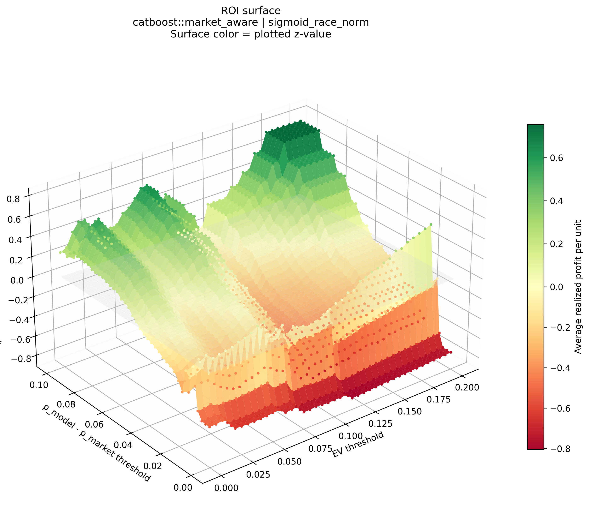
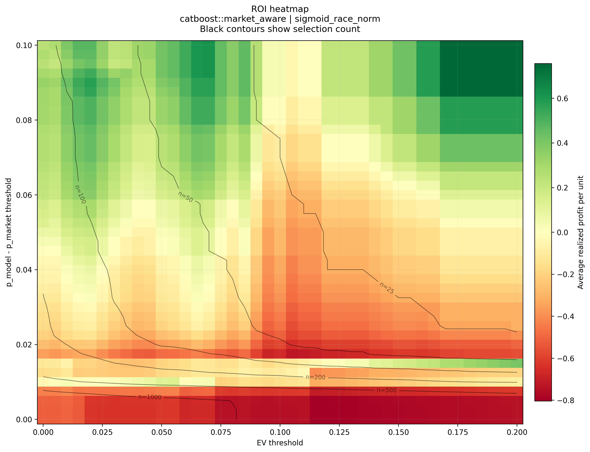
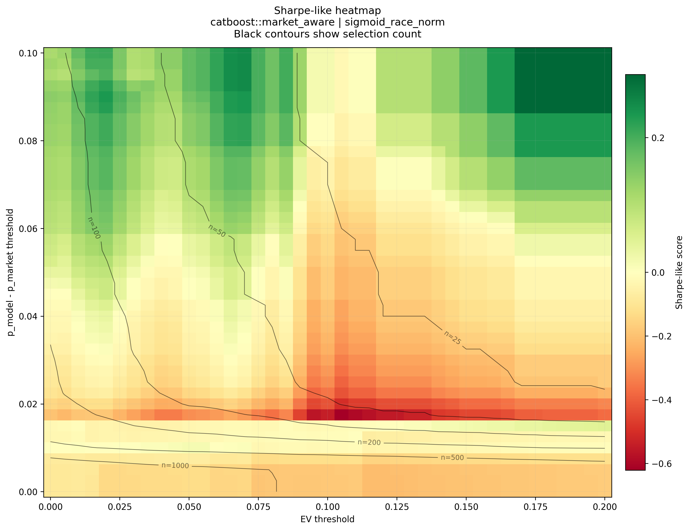
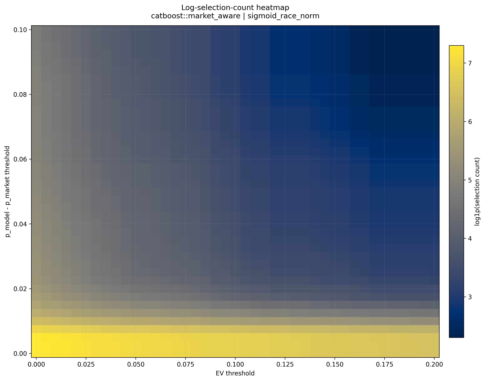
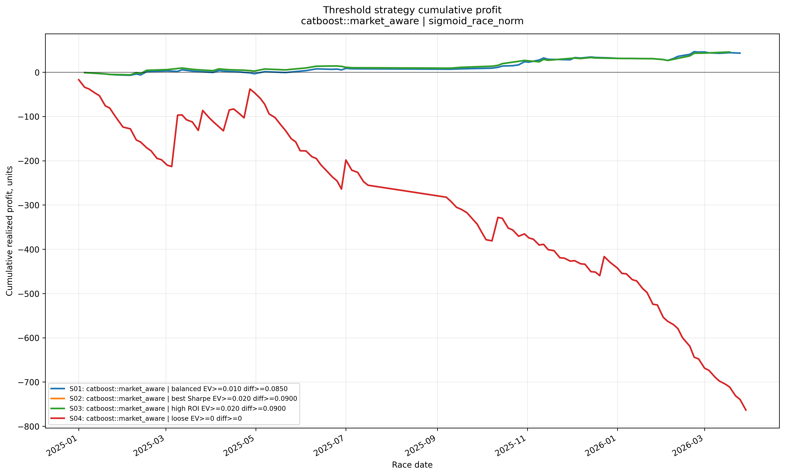
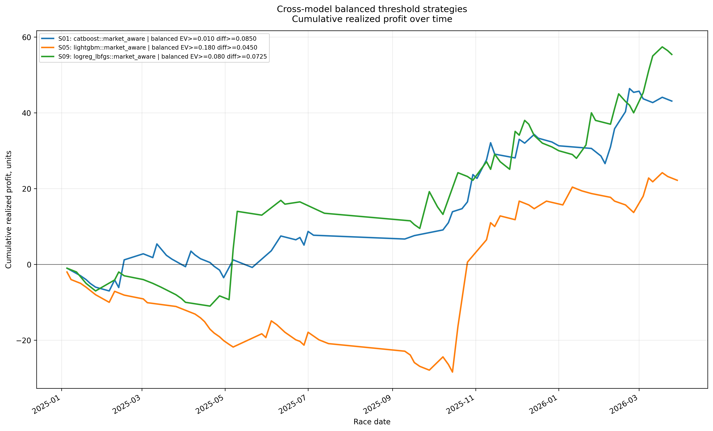
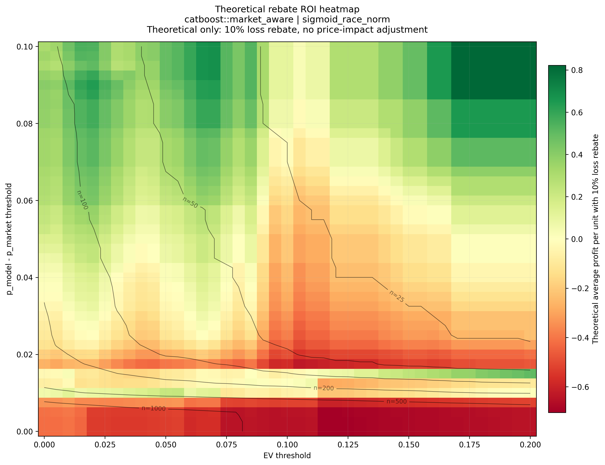

# HKJC Race Outcome Modeling: Chronological ML, Probability Calibration, and Market-Aware Strategy Research

## Foreword

You might be wondering why I chose to tackle the problem of horse racing, and that is a very valid question. 

Horse racing is no more stochastic than, say, stocks or the weather.

On the surface, there are two parts that contribute to the difficulty. The first is predicting the race results. With a plethora of variables related to the horses, jockeys, trainers, weather, track conditions, and so on, there is a lot in play. The second is figuring out whether those predictions can be turned into a strategy that is actually profitable and sustainable, not just something that looks good on paper.

But that is also what intrigued me.

I wanted to work on something that was difficult enough to be a real intellectual challenge, something to brainstorm at night. At the same time, horse racing felt niche enough that it was not completely impossible to approach. Compared to analysing stocks, it felt more contained, more unusual, and maybe just plausible enough that a working strategy could exist. I know that there have been people who studied racing seriously and were successful at it - Steven Brecher's "Beating the Races with a Computer" was a great inspiration.

And there is the thrill factor. With stocks, the average annual return is usually discussed in percentages over a long period of time. With horse racing, the result is much more immediate and much more unforgiving. A well-informed bet can still go to zero, but calling correctly on an under-bet horse can return many times the original stake in just a couple of minutes.

When I first started, I thought this would mostly be a machine-learning project, but as I worked on it, I realised that the model was only one part of the problem: figuring out how to obtain the data, how to engineer the scraper, how to store such a large amount of it, how to clean it, how to deal with exceptions, and how to decide what variables should even go into the machine in the first place.

So in the end, this project became much more than just trying to predict horse races. It became a way for me to take an idea that sounded slightly absurd at first, break it down, engineer, and see how far I could push it.

## Overview

Play responsibly. Gamble at your own risk.

I explored whether Hong Kong Jockey Club race outcomes can be modeled from structured historical race-result data, and whether those model outputs can be translated into a useful market-facing decision framework.

The workflow begins with a custom-built scraper and a private raw-data pipeline that collect and structure race-result data into SQLite databases. From there, the public research pipeline builds a one-horse-per-race modeling table, engineers strictly historical runner, jockey, trainer, and interaction features, trains multiple machine-learning baselines, calibrates predicted probabilities, and studies how model probabilities compare with tote-market prices.

The main conclusion is not simply that machine learning can rank horses reasonably well, but also that **market information is extremely valuable**. The problem has upgraded from a model fitting problem to a problem about **decision-time data availability and execution**.

## Research Question

Can a chronological horse-racing prediction pipeline:

1. produce useful runner-level win probabilities,
2. outperform a market-free benchmark when current market information is included,
3. and identify potentially favorable betting candidates in a pari-mutuel environment?

## The Repository

This public repository focuses on the **research pipeline** rather than the full private data-collection stack.

It includes:

- data cleaning and modeling-table construction,
- leakage-aware historical feature engineering,
- chronological train / validation / test evaluation,
- baseline model comparison,
- probability calibration,
- model-vs-market comparison,
- and offline strategy research.

It does **not** include the private scraper, raw HTML archive, or full database-refresh pipeline.

## Pipeline

```text
Private scraper / raw HKJC result pages
    -> cleaned SQLite database
    -> one-horse-per-race modeling table
    -> historical feature generation
    -> baseline model training (Logistic Regression, LightGBM, CatBoost)
    -> probability calibration (raw, sigmoid, isotonic, race-normalized)
    -> model-vs-market comparison
    -> offline strategy backtesting
```

## Data Coverage

At the current stage, the public research pipeline is built on a historical dataset covering races from **2020-01-01 to 2026-03-29**.

The cleaned modeling universe used for feature engineering and baseline training contains:

- **64,091** finished-runner rows,
- **5,282** modeled races,
- **4,089** distinct horses,
- **96** distinct jockeys,
- and **105** distinct trainers.

This gives the project enough scale to support meaningful chronological evaluation, feature engineering, and model comparison, while still leaving clear room for improvement in live market-data coverage and execution realism.

## Methodology

### 1) Modeling table construction

Runner-level records are built so that each row represents one horse in one race. Race-level information is joined onto runner rows, and only valid finished runners are retained for the main supervised-learning table.

Special cases such as withdrawals, non-standard result statuses, dead heats, and cancelled / abnormal pages are handled explicitly during the database-cleaning pipeline so that the main modeling table remains suitable for supervised learning while excluded rows remain traceable separately.

### 2) Historical feature engineering

Features are designed to use information available **before** each race, including:

- horse historical starts, wins, top-3 rates,
- same-course, same-distance, and same-surface history,
- jockey historical performance,
- trainer historical performance,
- horse-jockey interaction history,
- horse-trainer interaction history,
- and race context such as distance, draw, field size, and carried weight.

Two feature sets are maintained:

- **Market-free**: excludes current-race odds
- **Market-aware**: includes current-race `win_odds` and `log_win_odds`

This separation is important because it isolates the incremental predictive value of the public market signal.

### 3) Chronological evaluation

All model evaluation is performed using time-based train / validation / test splits rather than random shuffles. This makes the setup closer to a real forecasting workflow.

### 4) Models compared

The project compares several baseline model families:

- Logistic Regression
- LightGBM
- CatBoost

### 5) Probability calibration

Raw model probabilities are further calibrated using:

- raw output,
- sigmoid calibration,
- isotonic calibration,
- and race-normalized variants.

For the race-normalized variants, each horse's calibrated probability is divided by the sum of the calibrated probabilities for all horses in the same race. This creates race-level probability vectors that sum to approximately one.

Model-method combinations are ranked using proper scoring rules such as **log loss** and **Brier score**, along with race-level ranking metrics.

## Main Results

### Raw baseline model comparison (test split)

Among the baseline model families, the strongest **uncalibrated** market-aware models were:

| Model | Log Loss | Brier Score | Top-Pick Win Rate | Winner-in-Top-3 Rate |
|---|---:|---:|---:|---:|
| CatBoost market-aware | 0.235398 | 0.065685 | 32.70% | 62.14% |
| LightGBM market-aware | 0.235666 | 0.065809 | 32.34% | 61.41% |
| Logistic Regression market-aware | 0.235710 | 0.065843 | 31.25% | 62.77% |

The first logistic baseline also showed a clear gap between market-free and market-aware variants on the test split:

| Variant | Log Loss | Brier Score | Top-Pick Win Rate | Winner-in-Top-3 Rate |
|---|---:|---:|---:|---:|
| Market-free | 0.258271 | 0.070539 | 24.91% | 51.27% |
| Market-aware | 0.235710 | 0.065843 | 31.25% | 62.77% |

**Interpretation:** current market odds contain substantial predictive value. Historical form alone retains signal, but the public market remains a very strong input.

### Best calibrated model-method combination

The strongest calibrated test result in the current workflow was:

**CatBoost market-aware + sigmoid calibration + race normalization**

- Log loss: **0.234958**
- Brier score: **0.065478**
- Top-pick win rate: **32.70%**
- Winner-in-top-3 rate: **62.14%**

Calibration improved proper-scoring performance modestly and produced cleaner race-level probability vectors, rather than dramatically changing rank accuracy.

## Strategy Research Findings

It is obvious that **predictive accuracy does not automatically imply profitability**, especially in a pari-mutuel market where price matters as much as hit rate.

When betting every model top pick from the shortlisted market-aware pipelines, results remained negative on the test set:

| Strategy | ROI |
|---|---:|
| CatBoost market-aware + sigmoid_race_norm + top_pick_all | -8.41% |
| LightGBM market-aware + raw_race_norm + top_pick_all | -9.00% |
| Logistic Regression market-aware + raw_race_norm + top_pick_all | -15.06% |

This top-pick baseline shows that ranking accuracy alone is not enough. This motivated a second-stage model-vs-market analysis. 

## Threshold Diagnostic Visuals

To better understand where model-vs-market disagreement becomes useful, I also tested threshold rules across two dimensions:

- **EV threshold**: minimum model-implied expected net profit per unit
- **Probability-gap threshold**: minimum difference between model win probability and market-implied probability

The following figures focus on the strongest calibrated model-method combination:

**CatBoost market-aware + sigmoid calibration + race normalization**

### ROI surface

The 3D surface shows realized ROI across the threshold grid. Green regions indicate positive realized profit per unit, while red regions indicate negative realized profit per unit.



### ROI heatmap with selection-count contours

The heatmap gives a clearer view of the same ROI landscape. Black contour lines show approximate selection counts, which helps separate high-ROI regions with reasonable sample support from very small-sample regions.



### Sharpe-like risk-adjusted performance

The Sharpe-like score is calculated as:

```text
average realized profit per unit / standard deviation of realized profit per unit
```

This is not a formal financial Sharpe ratio, but it is useful for comparing average profit against realized volatility.



### Selection count

Selection count falls quickly as thresholds become stricter. This matters because very high ROI from only a few selections may not be reliable.



### Cumulative profit by threshold rule

The loose baseline rule loses heavily, while the more selective threshold candidates show positive retrospective performance over the test period.



### Cross-model balanced threshold candidates

This plot compares balanced retrospective threshold candidates from CatBoost, LightGBM, and Logistic Regression. These are not ensemble results; they are side-by-side strategy candidates selected from each model family.



### Theoretical rebate scenario

The project also includes a theoretical 10% loss-rebate scenario. This assumes losing selections receive a 10% stake rebate and ignores pari-mutuel price impact from placing larger stakes.

This is a sensitivity analysis, not a live-executable claim.



### Example threshold candidates

The threshold diagnostics produced the following retrospective candidates:

| Model | Rule Type | EV Threshold | Probability-Gap Threshold | Selections | ROI | Theoretical Rebate ROI | Sharpe-like |
|---|---|---:|---:|---:|---:|---:|---:|
| CatBoost market-aware + sigmoid_race_norm | Balanced | 0.010 | 0.0850 | 106 | 40.66% | 47.55% | 0.168 |
| CatBoost market-aware + sigmoid_race_norm | Higher ROI | 0.020 | 0.0900 | 79 | 57.72% | 64.18% | 0.233 |
| LightGBM market-aware + raw_race_norm | Balanced | 0.180 | 0.0450 | 100 | 22.20% | 30.30% | 0.074 |
| Logistic Regression market-aware + raw_race_norm | Balanced | 0.080 | 0.0725 | 105 | 52.76% | 60.57% | 0.167 |

These are **retrospective threshold candidates** chosen from historical test-set diagnostics. They should not be read as production-ready rules.

## Core Bottleneck

HKJC uses a pari-mutuel betting system, meaning the final odds are not fully known at the exact moment a bet must be placed. A large share of betting volume can arrive very late, which causes meaningful movement in the live odds close to pool closure.

This matters because the strongest model and the most attractive selective strategy variants both depend on odds-derived information. The offline research results therefore do not map cleanly into a live executable strategy.

Even if the final odds could be forecast in advance, a second challenge remains: whether the model output can be processed and acted on quickly enough before the pool closes.

This matters as **the real constraint is data and implementation, not model complexity**.

## Current Limitations

- The strongest workflows are market-aware and therefore sensitive to decision-time odds availability.
- Offline ROI pockets rely on odds-based selection filters that may not be stable live.
- Threshold candidates were selected retrospectively from historical diagnostics.
- The current research pipeline is batch-oriented rather than a production real-time inference system.
- The theoretical rebate analysis ignores pari-mutuel price impact.
- Some historical-feature timing choices are acceptable for research, but would need to be tightened further for a stricter live-trading style setup.

## Next Steps

There are several realistic continuation paths:

1. **Pre-off live-odds collection**  
   Build or source a fresh stream of timestamped live odds so decisions can be evaluated using information that is actually available before race start. HKJC does not provide a historical archive of live odds, so this data would need to be collected prospectively or sourced externally.

2. **Final-odds forecasting layer**  
   Train a time-series model that maps earlier market snapshots to estimated final odds, then feed those estimated odds into the market-aware research framework. The main challenge here is still data availability rather than model design.
   
3. **Out-of-sample threshold validation**
   Freeze candidate threshold rules and evaluate them on future races rather than selecting thresholds retrospectively.

4. **Real-time execution prototype**  
   Add live data ingestion, real-time feature generation, inference, candidate selection, and cutoff-aware execution logic.

5. **Bet size optimization**  
   Implement Kelly Criterion adjustments to bet size: current scheme assumes same stakes for every selection.

6. **Refine race-row/runner-row features**  
   Add features like horse age, colour, country of origin, gear/equipment change - previous research have shown that these have correlation to performance. Can also analyse sectional times.

## Public Repository Structure

```text
hkjc-ml-research/
├── README.md
├── requirements.txt
├── .gitignore
├── PUBLIC_FILE_RENAMING_GUIDE.md
├── scripts/
│   ├── build_modeling_table.py
│   ├── build_historical_features.py
│   ├── sanity_check_features.py
│   ├── train_logistic_baseline.py
│   ├── train_lightgbm_baseline.py
│   ├── train_catboost_baseline.py
│   ├── compare_baseline_models.py
│   ├── calibrate_probabilities.py
│   ├── compare_model_vs_market.py
│   └── backtest_top_runner_strategy.py
├── results/
│   ├── baseline_model_test_ranking.csv
│   ├── calibrated_probability_test_ranking.csv
│   ├── top_runner_strategy_summary.csv
│   └── model_market_threshold_summary.csv
└── figures/
    └── threshold_diagnostics/
        ├── catboost_roi_surface.png
        ├── catboost_roi_heatmap.png
        ├── catboost_sharpe_like_heatmap.png
        ├── catboost_log_selection_count_heatmap.png
        ├── catboost_strategy_cumulative_profit.png
        ├── cross_model_balanced_strategies_cumulative_profit.png
        └── catboost_theoretical_rebate_roi_heatmap.png
```

## How to Read This Repository

A simple way to navigate the project is:

1. **Modeling-table scripts**  
   Build the one-horse-per-race supervised-learning base table.

2. **Historical feature scripts**  
   Add horse, jockey, trainer, and interaction history while preserving chronological logic.

3. **Training scripts**  
   Fit Logistic Regression, LightGBM, and CatBoost baselines.

4. **Calibration and comparison scripts**  
   Improve probability quality and compare model families fairly.

5. **Model-vs-market and backtest scripts**  
   Study how calibrated model probabilities relate to tote-market prices and simple offline decision rules.

6. **Threshold diagnostic figures**  
   Use the heatmaps and cumulative-profit plots to understand where model-vs-market disagreement becomes more useful.

## Installation

```bash
python -m venv .venv
source .venv/bin/activate
pip install -r requirements.txt
```

## Disclaimer

This project is for research and educational purposes only.

Feel free to let me know your thoughts and insights. :)

## License

This repository’s code is released under the MIT License. See [`LICENSE`](LICENSE).

This repository does not redistribute raw Hong Kong Jockey Club data. Any third-party data remains subject to the terms of the original data provider. The project is intended for research, education, and portfolio demonstration purposes.

**Project links:** [View repository code](https://github.com/jerrydaphantom/hkjc-ml-research) | [View project page](https://jerrydaphantom.github.io/hkjc-ml-research/)
